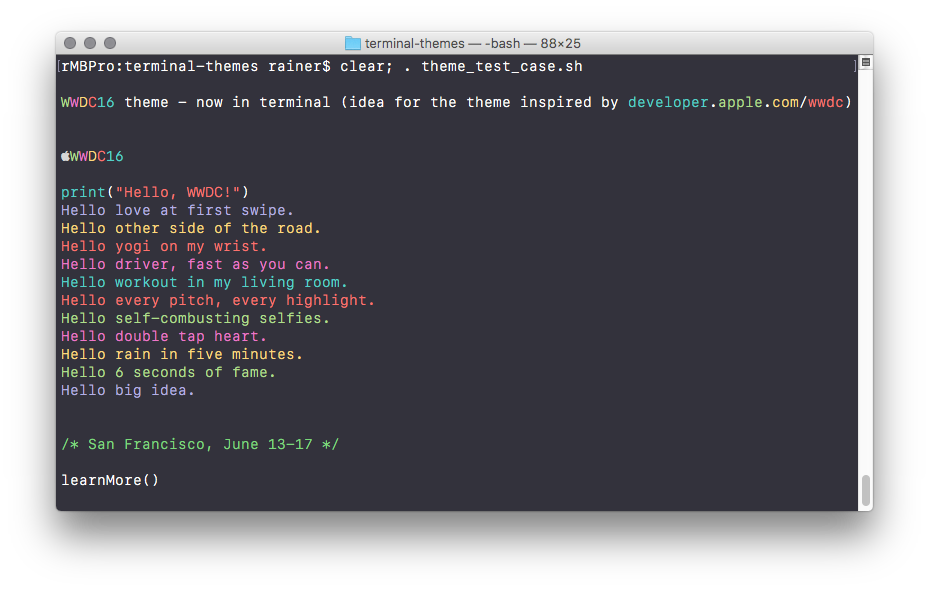
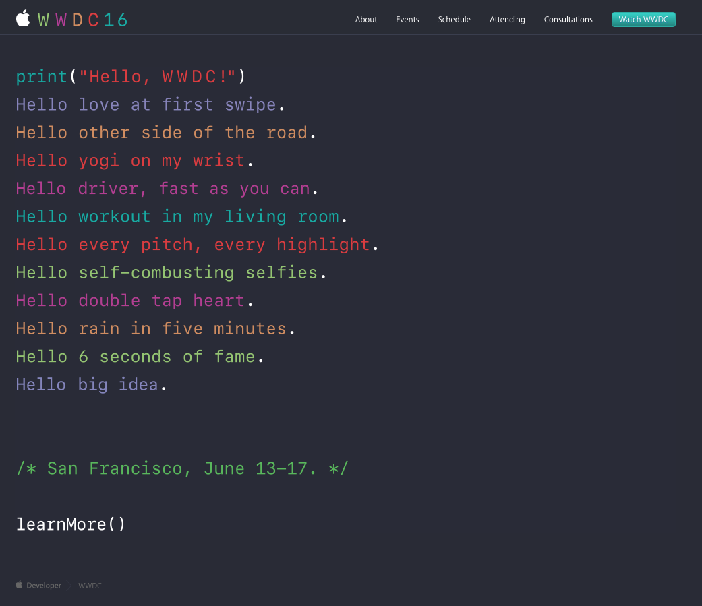

# Summary
WWDC-2016-terminal-theme is, like the name implies, theme inspired by the WWDC 2016 invitation.

## Terminal preview:

## Original WWDC 2016 invitation:

## System Requirements
This theme is designed for macOS 10.12 Sierra, which includes SF Mono font for Terminal.app 

- If you're not on 10.12 yet, you should update.
- If you can't update, you can rip out SF Mono from XCode 8:
	* Go to /Applications/Xcode.app/Contents/SharedFrameworks/DVTKit.framework/Versions/A/Resources/Fonts/
	* Select all SF Monos and add them to Font Book
- If you can't get XCode 8 you should change the theme font: Terminal > Preferences > Profiles > WWDC > Text
